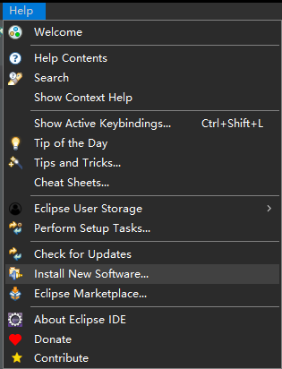
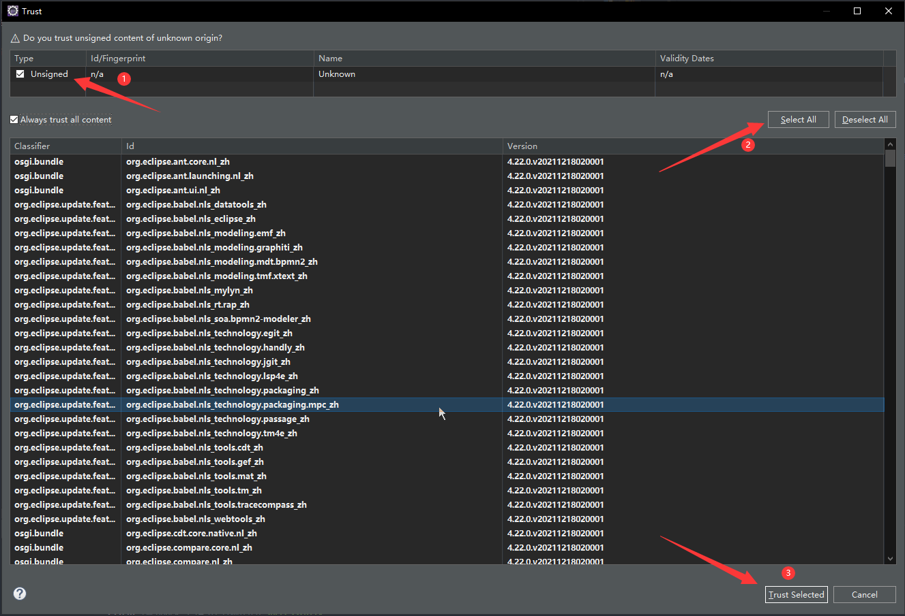

# 安装配置 Eclipse

<!--truncate-->

要不是这瓜皮蓝桥杯谁用这个。

## 安装

### Eclipse

前往 [官方网站](https://www.eclipse.org/) 下载并安装 Eclipse。

[](https://www.eclipse.org/downloads/packages/)

Windows 下也可以使用 [Chocolatey](/docs/编程/包管理器/Chocolatey/) 安装 [Eclipse](https://community.chocolatey.org/packages/eclipse)：

```shell
choco install eclipse -y
```

### Spring Tools 4 for Eclipse

前往 [官网网站](https://spring.io/tools) 下载并安装 Spring Tools 4 for Eclipse

Windows 下也可以使用 [Chocolatey](/docs/编程/包管理器/Chocolatey/) 安装 [SpringToolsSuite](https://community.chocolatey.org/packages/SpringToolSuite)

```shell
choco install springtoolsuite -y
```

## 安装中文语言包

前往 <https://archive.eclipse.org/technology/babel/>。






等后台下完，重启下 Eclipse 就好了。


## 个性化

- [【Eclipse】将Tab替换为空格 - 伊凡Ivan - 博客园](https://www.cnblogs.com/conquerorren/p/8520579.html)

### 启用代码提示

**菜单栏 → 窗口 → 首选项 → Java → 内容辅助 → 自动激活** 中修改设置：

- 自动激活延迟 `2`
- Java 的自动激活触发器 `abcdefghijklmnopqrstuvwxyz.`


> 参考：[eclipse代码自动提示设置 - dodo-yufan - 博客园](https://www.cnblogs.com/zgqys1980/p/5067337.html)

### 设置编辑器字体


## 教程

- [Eclipse 教程 | 菜鸟教程](https://www.runoob.com/eclipse/eclipse-tutorial.html)
- [Eclipse 快捷键 | 菜鸟教程](https://www.runoob.com/eclipse/eclipse-shortcuts.html)

