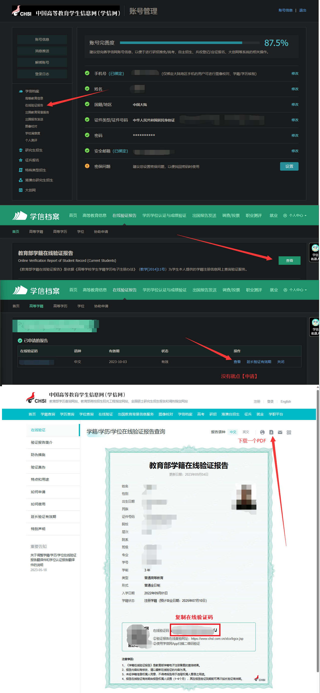
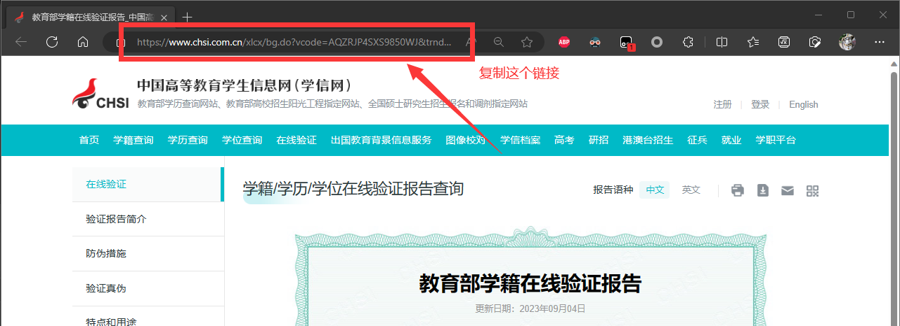
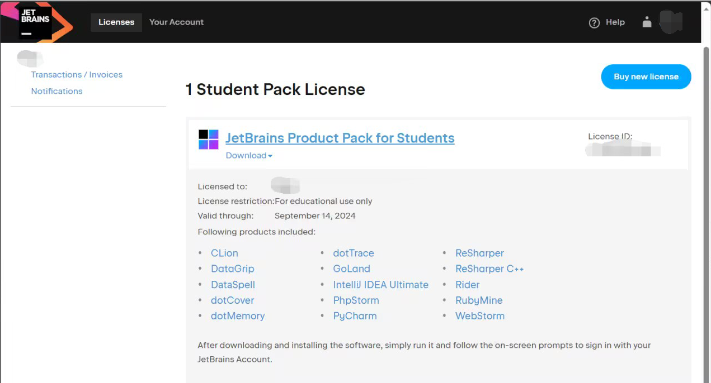

# JetBrains 免费教育许可证

## 学信网申请教育部学籍在线验证报告

打开 <https://www.chsi.com.cn/>，登入后点击 **账号信息**，参考下图操作：

## 免费许可证计划

查看 [免费许可证计划](https://www.jetbrains.com/zh-cn/community/education/#students) 的相关限制。

打开 [立即申请 JetBrains 学习产品](https://www.jetbrains.com/shop/eform/students) 填写表单：

申请方式选择**官方文件**。

- 您的学术机构的名称：**九江职业技术学院**
- 您的学术机构的网站：<https://www.jvtc.jx.cn/>
- **勾选 √** 我的教育机构提供高等教育并颁发国家认可的文凭
- **勾选 √** 我参加的教育课程需要一年或更长时间的全日制学习来完成
- 官方文件上传学信网下的 PDF 文件
- 添加任何证明您与您的学术机构有附属关系的正式文件（如学生证），
  或提供可以找到此类信息的链接：
  
- 学信网报告在线验证码：**复制 *教育部学籍在线验证报告* 上的在线验证码**
- **勾选 √** 我已阅读并接受 JetBrains Account 协议
- 点击 **申请免费产品**

提交表单后大概两周内会给申请邮箱发邮件，用申请邮箱注册一个 JetBrains 账号即可。

可以下载 [JetBrains Toolbox](https://www.jetbrains.com/zh-cn/lp/toolbox/) 方便管理多个 IDE。
