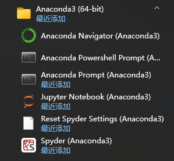
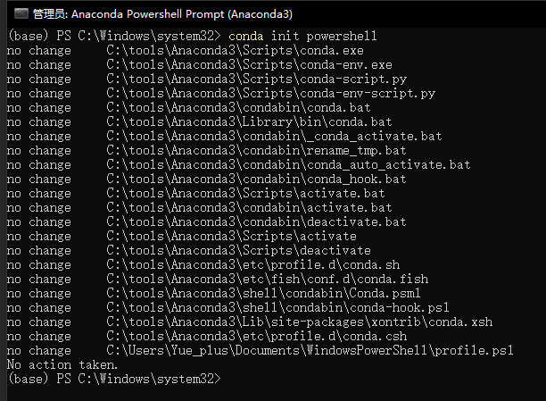

# Anaconda

:::info
Anaconda 提供了在一台机器上执行 Python/R 数据科学和机器学习的最简单方法。

| [官网](https://www.anaconda.com/)
| [Anaconda 文档](https://docs.anaconda.com/)
| [conda 文档](https://docs.conda.io/)
|
:::

## 安装

- [前往官网](https://www.anaconda.com/) 下载安装
- [使用 Chocolatey 安装](https://community.chocolatey.org/packages/anaconda3)
    ```powershell
    choco install anaconda3 -y
    ```    

安装完成后开始菜单中会有以下程序：



## 配置

### 在 PowerShell 中启用 `conda`

以 **管理员身份运行** Anaconda Powershell Prompt 并执行以下指令：

```ps
conda init powershell
```



启动 PowerShell 时不要默认启动 Anaconda：

```ps
conda config --set auto_activate_base False
```

需要时可手动启动：

```ps
conda activate base
```

### 配置镜像源

- [anaconda | 镜像站使用帮助 | 清华大学开源软件镜像站 | Tsinghua Open Source Mirror](https://mirrors.tuna.tsinghua.edu.cn/help/anaconda/)
- [anaconda镜像_anaconda下载地址_anaconda安装教程-阿里巴巴开源镜像站](https://developer.aliyun.com/mirror/anaconda)

## 使用

安装完成后可使用 `conda` 命令：

<details>
<summary><code>conda -h</code></summary>

```text
(base) PS C:\Users\Yue_plus> conda -h
usage: conda-script.py [-h] [-V] command ...

conda is a tool for managing and deploying applications, environments and packages.

Options:

positional arguments:
  command
    clean        Remove unused packages and caches.
    compare      Compare packages between conda environments.
    config       Modify configuration values in .condarc. This is modeled after the git config command. Writes to the user .condarc file (C:\Users\Yue_plus\.condarc) by default. Use the --show-sources flag
                 to display all identified configuration locations on your computer.
    create       Create a new conda environment from a list of specified packages.
    info         Display information about current conda install.
    init         Initialize conda for shell interaction.
    install      Installs a list of packages into a specified conda environment.
    list         List installed packages in a conda environment.
    package      Low-level conda package utility. (EXPERIMENTAL)
    remove       Remove a list of packages from a specified conda environment.
    rename       Renames an existing environment.
    run          Run an executable in a conda environment.
    search       Search for packages and display associated information.The input is a MatchSpec, a query language for conda packages. See examples below.
    uninstall    Alias for conda remove.
    update       Updates conda packages to the latest compatible version.
    upgrade      Alias for conda update.
    notices      Retrieves latest channel notifications.

optional arguments:
  -h, --help     Show this help message and exit.
  -V, --version  Show the conda version number and exit.

conda commands available from other packages:
  build
  content-trust
  convert
  debug
  develop
  env
  index
  inspect
  metapackage
  pack
  render
  repo
  server
  skeleton
  token
  verify
```

</details>

### 依赖包管理文件

> 参考 [Managing environments — conda documentation](https://conda.io/projects/conda/en/latest/user-guide/tasks/manage-environments.html#sharing-an-environment)

conda 通常使用 `environment.yml` 文件记录依赖包。

#### 导出当前环境的依赖

```ps
conda env export --from-history > environment.yaml
```

#### 从文件创建新环境

```ps
conda env create --file environment.yml
```

### 常用命令

```shell
# 查看安装了哪些包
conda list

# 查看当前存在哪些虚拟环境
conda env list 
conda info -e

# 检查更新当前 conda
conda update conda

# 创建新的虚拟环境
conda create --name $ENV_NAME python=x.x

# 删除虚拟环境
conda env remove --name $ENV_NAME

# 切换环境
conda activate $ENV_NAME
```

## Miniconda

- [Miniconda — conda documentation](https://docs.conda.io/en/latest/miniconda.html)
