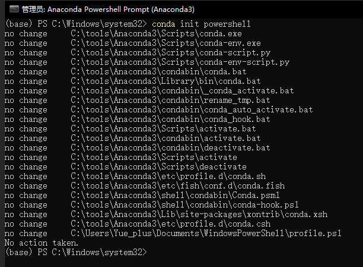

# Anaconda

:::info
Anaconda 提供了在一台机器上执行 Python/R 数据科学和机器学习的最简单方法。

| [官网](https://www.anaconda.com/)
| [文档](https://docs.conda.io/)
|
:::

## 安装

- [前往官网](https://www.anaconda.com/) 下载安装
- [使用 Chocolatey 安装](https://community.chocolatey.org/packages/anaconda3)
    ```powershell
    choco install anaconda3 -y
    ```    

安装完成后开始菜单中会有以下程序：


## 配置

### 在 PowerShell 中启用 `conda`

以 **管理员身份运行** Anaconda Powershell Prompt 并执行以下指令：

```text
conda init powershell
```



## 使用


